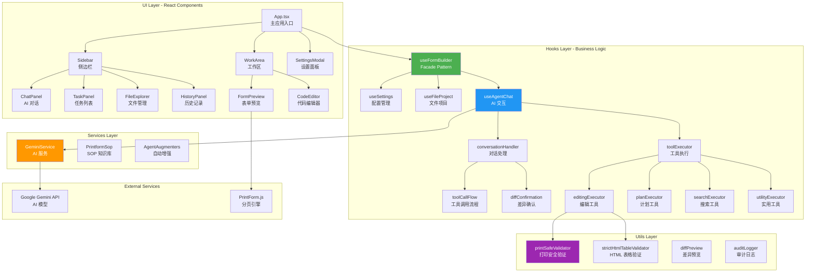
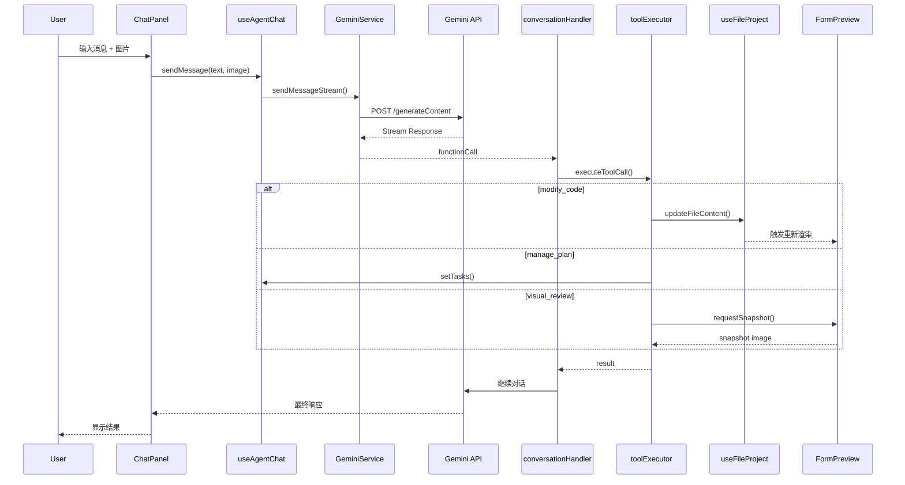
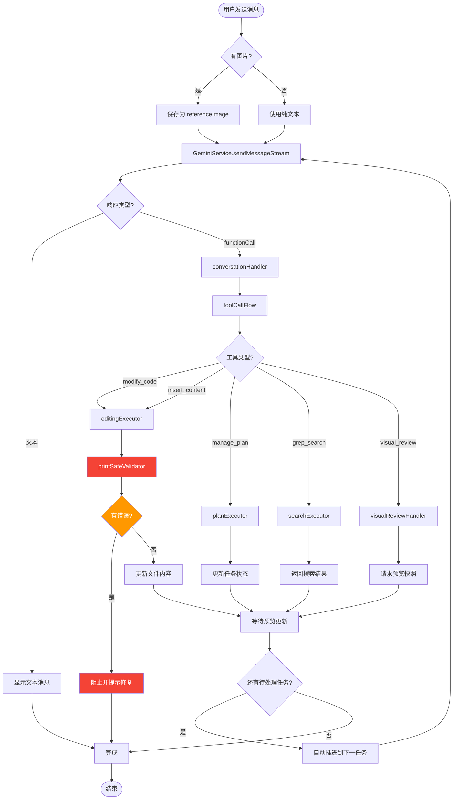
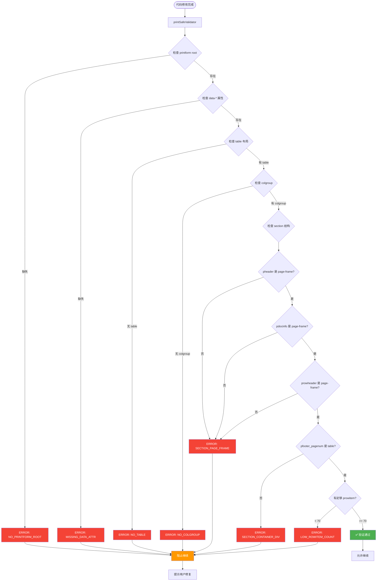
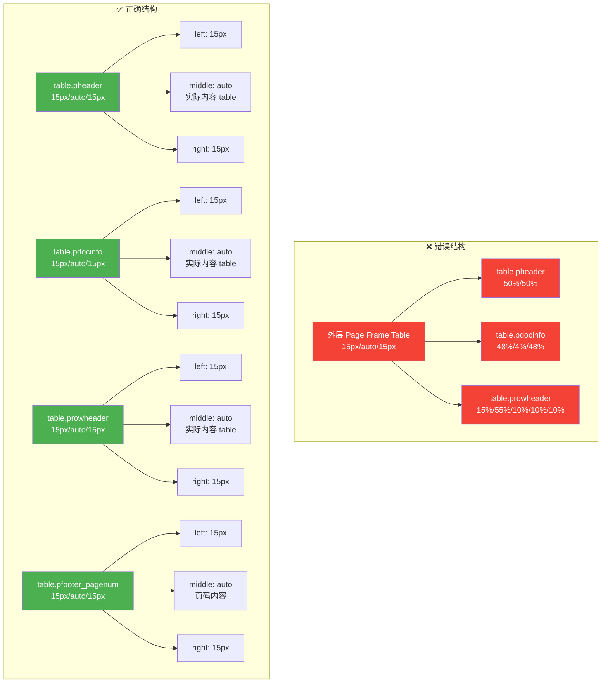
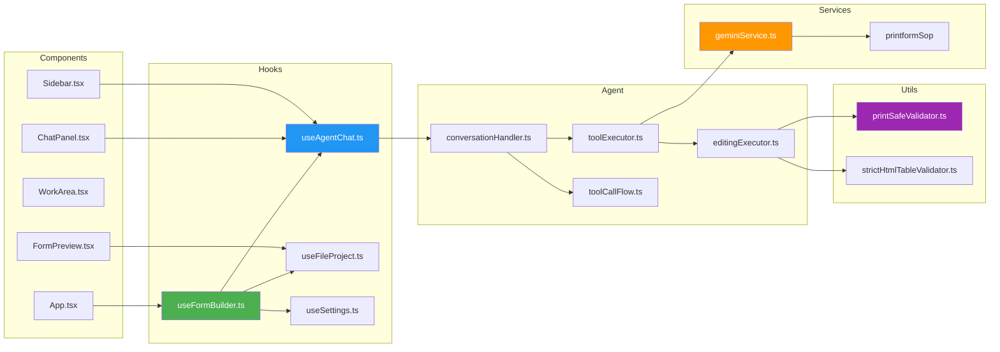

# FormGenie 架构图

## 整体架构

```mermaid
graph TB
    subgraph "UI Layer - React Components"
        A[App.tsx<br/>主应用入口]
        A --> B1[Sidebar<br/>侧边栏]
        A --> B2[WorkArea<br/>工作区]
        A --> B3[SettingsModal<br/>设置面板]
        
        B1 --> C1[ChatPanel<br/>AI 对话]
        B1 --> C2[TaskPanel<br/>任务列表]
        B1 --> C3[FileExplorer<br/>文件管理]
        B1 --> C4[HistoryPanel<br/>历史记录]
        
        B2 --> D1[FormPreview<br/>表单预览]
        B2 --> D2[CodeEditor<br/>代码编辑器]
    end
    
    subgraph "Hooks Layer - Business Logic"
        E[useFormBuilder<br/>Facade Pattern]
        E --> F1[useSettings<br/>配置管理]
        E --> F2[useFileProject<br/>文件项目]
        E --> F3[useAgentChat<br/>AI 交互]
        
        F3 --> G1[conversationHandler<br/>对话处理]
        F3 --> G2[toolExecutor<br/>工具执行]
        
        G1 --> H1[toolCallFlow<br/>工具调用流程]
        G1 --> H2[diffConfirmation<br/>差异确认]
        
        G2 --> I1[editingExecutor<br/>编辑工具]
        G2 --> I2[planExecutor<br/>计划工具]
        G2 --> I3[searchExecutor<br/>搜索工具]
        G2 --> I4[utilityExecutor<br/>实用工具]
    end
    
    subgraph "Services Layer"
        J1[GeminiService<br/>AI 服务]
        J2[PrintformSop<br/>SOP 知识库]
        J3[AgentAugmenters<br/>自动增强]
    end
    
    subgraph "Utils Layer"
        K1[printSafeValidator<br/>打印安全验证]
        K2[strictHtmlTableValidator<br/>HTML 表格验证]
        K3[diffPreview<br/>差异预览]
        K4[auditLogger<br/>审计日志]
    end
    
    subgraph "External Services"
        L1[Google Gemini API<br/>AI 模型]
        L2[PrintForm.js<br/>分页引擎]
    end
    
    A --> E
    F3 --> J1
    J1 --> L1
    I1 --> K1
    I1 --> K2
    D1 --> L2
    
    style E fill:#4CAF50,color:#fff
    style F3 fill:#2196F3,color:#fff
    style J1 fill:#FF9800,color:#fff
    style K1 fill:#9C27B0,color:#fff
```

## 数据流图

```mermaid
sequenceDiagram
    participant User
    participant ChatPanel
    participant useAgentChat
    participant GeminiService
    participant Gemini API
    participant conversationHandler
    participant toolExecutor
    participant useFileProject
    participant FormPreview
    
    User->>ChatPanel: 输入消息 + 图片
    ChatPanel->>useAgentChat: sendMessage(text, image)
    useAgentChat->>GeminiService: sendMessageStream()
    GeminiService->>Gemini API: POST /generateContent
    
    Gemini API-->>GeminiService: Stream Response
    GeminiService-->>conversationHandler: functionCall
    
    conversationHandler->>toolExecutor: executeToolCall()
    
    alt modify_code
        toolExecutor->>useFileProject: updateFileContent()
        useFileProject-->>FormPreview: 触发重新渲染
    else manage_plan
        toolExecutor->>useAgentChat: setTasks()
    else visual_review
        toolExecutor->>FormPreview: requestSnapshot()
        FormPreview-->>toolExecutor: snapshot image
    end
    
    toolExecutor-->>conversationHandler: result
    conversationHandler->>Gemini API: 继续对话
    
    Gemini API-->>ChatPanel: 最终响应
    ChatPanel-->>User: 显示结果
```

## 工具执行流程

```mermaid
flowchart TD
    Start([用户发送消息]) --> A{有图片?}
    A -->|是| B[保存为 referenceImage]
    A -->|否| C[使用纯文本]
    
    B --> D[GeminiService.sendMessageStream]
    C --> D
    
    D --> E{响应类型?}
    
    E -->|文本| F[显示文本消息]
    E -->|functionCall| G[conversationHandler]
    
    G --> H[toolCallFlow]
    
    H --> I{工具类型?}
    
    I -->|modify_code| J1[editingExecutor]
    I -->|insert_content| J1
    I -->|manage_plan| J2[planExecutor]
    I -->|grep_search| J3[searchExecutor]
    I -->|visual_review| J4[visualReviewHandler]
    
    J1 --> K1[printSafeValidator]
    K1 --> L{有错误?}
    
    L -->|是| M[阻止并提示修复]
    L -->|否| N[更新文件内容]
    
    J2 --> O[更新任务状态]
    J3 --> P[返回搜索结果]
    J4 --> Q[请求预览快照]
    
    N --> R[等待预览更新]
    O --> R
    P --> R
    Q --> R
    
    R --> S{还有待处理任务?}
    
    S -->|是| T[自动推进到下一任务]
    S -->|否| U[完成]
    
    T --> D
    M --> U
    F --> U
    U --> End([结束])
    
    style K1 fill:#f44336,color:#fff
    style L fill:#ff9800,color:#fff
    style M fill:#f44336,color:#fff
```

## Print-Safe 验证流程

```mermaid
flowchart TD
    Start([代码修改完成]) --> A[printSafeValidator]
    
    A --> B1{检查 printform root}
    B1 -->|缺失| E1[ERROR: NO_PRINTFORM_ROOT]
    B1 -->|存在| B2{检查 data-* 属性}
    
    B2 -->|缺失| E2[ERROR: MISSING_DATA_ATTR]
    B2 -->|存在| B3{检查 table 布局}
    
    B3 -->|无 table| E3[ERROR: NO_TABLE]
    B3 -->|有 table| B4{检查 colgroup}
    
    B4 -->|无 colgroup| E4[ERROR: NO_COLGROUP]
    B4 -->|有 colgroup| B5{检查 section 结构}
    
    B5 --> C1{pheader 是 page-frame?}
    C1 -->|否| E5[ERROR: SECTION_PAGE_FRAME]
    C1 -->|是| C2{pdocinfo 是 page-frame?}
    
    C2 -->|否| E5
    C2 -->|是| C3{prowheader 是 page-frame?}
    
    C3 -->|否| E5
    C3 -->|是| C4{pfooter_pagenum 是 table?}
    
    C4 -->|否| E6[ERROR: SECTION_CONTAINER_DIV]
    C4 -->|是| D{有足够 prowitem?}
    
    D -->|< 70| E7[ERROR: LOW_ROWITEM_COUNT]
    D -->|>= 70| F[✅ 验证通过]
    
    E1 --> G[阻止继续]
    E2 --> G
    E3 --> G
    E4 --> G
    E5 --> G
    E6 --> G
    E7 --> G
    
    G --> H[提示用户修复]
    F --> I[允许继续]
    
    style E1 fill:#f44336,color:#fff
    style E2 fill:#f44336,color:#fff
    style E3 fill:#f44336,color:#fff
    style E4 fill:#f44336,color:#fff
    style E5 fill:#f44336,color:#fff
    style E6 fill:#f44336,color:#fff
    style E7 fill:#f44336,color:#fff
    style F fill:#4caf50,color:#fff
    style G fill:#ff9800,color:#fff
```

## Section-as-Page-Frame 结构

```mermaid
graph TB
    subgraph "❌ 错误结构"
        W1[外层 Page Frame Table<br/>15px/auto/15px]
        W1 --> W2[table.pheader<br/>50%/50%]
        W1 --> W3[table.pdocinfo<br/>48%/4%/48%]
        W1 --> W4[table.prowheader<br/>15%/55%/10%/10%/10%]
    end
    
    subgraph "✅ 正确结构"
        R1[table.pheader<br/>15px/auto/15px]
        R1 --> R1A[left: 15px]
        R1 --> R1B[middle: auto<br/>实际内容 table]
        R1 --> R1C[right: 15px]
        
        R2[table.pdocinfo<br/>15px/auto/15px]
        R2 --> R2A[left: 15px]
        R2 --> R2B[middle: auto<br/>实际内容 table]
        R2 --> R2C[right: 15px]
        
        R3[table.prowheader<br/>15px/auto/15px]
        R3 --> R3A[left: 15px]
        R3 --> R3B[middle: auto<br/>实际内容 table]
        R3 --> R3C[right: 15px]
        
        R4[table.pfooter_pagenum<br/>15px/auto/15px]
        R4 --> R4A[left: 15px]
        R4 --> R4B[middle: auto<br/>页码内容]
        R4 --> R4C[right: 15px]
    end
    
    style W1 fill:#f44336,color:#fff
    style W2 fill:#f44336,color:#fff
    style W3 fill:#f44336,color:#fff
    style W4 fill:#f44336,color:#fff
    
    style R1 fill:#4caf50,color:#fff
    style R2 fill:#4caf50,color:#fff
    style R3 fill:#4caf50,color:#fff
    style R4 fill:#4caf50,color:#fff
```

## 文件依赖关系

```mermaid
graph LR
    subgraph "Components"
        A1[App.tsx]
        A2[Sidebar.tsx]
        A3[WorkArea.tsx]
        A4[ChatPanel.tsx]
        A5[FormPreview.tsx]
    end
    
    subgraph "Hooks"
        B1[useFormBuilder.ts]
        B2[useAgentChat.ts]
        B3[useFileProject.ts]
        B4[useSettings.ts]
    end
    
    subgraph "Agent"
        C1[conversationHandler.ts]
        C2[toolExecutor.ts]
        C3[toolCallFlow.ts]
        C4[editingExecutor.ts]
    end
    
    subgraph "Services"
        D1[geminiService.ts]
        D2[printformSop]
    end
    
    subgraph "Utils"
        E1[printSafeValidator.ts]
        E2[strictHtmlTableValidator.ts]
    end
    
    A1 --> B1
    A2 --> B2
    A4 --> B2
    A5 --> B3
    
    B1 --> B2
    B1 --> B3
    B1 --> B4
    
    B2 --> C1
    C1 --> C2
    C1 --> C3
    C2 --> C4
    
    C2 --> D1
    C4 --> E1
    C4 --> E2
    
    D1 --> D2
    
    style B1 fill:#4CAF50,color:#fff
    style B2 fill:#2196F3,color:#fff
    style D1 fill:#FF9800,color:#fff
    style E1 fill:#9C27B0,color:#fff
```
