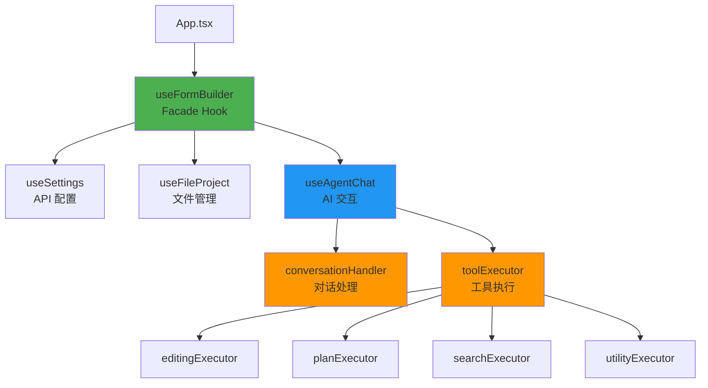

# 📊 FormGenie 代码库全面审查报告

**审查日期**: 2026-01-24  
**审查人**: Tech Lead  
**项目版本**: v1.1.3  
**代码库状态**: ✅ 良好,有改进空间

---

## 🎯 执行摘要

### 整体评分: **8.2/10** ⭐⭐⭐⭐

| 维度 | 评分 | 状态 |
|------|------|------|
| 代码质量 | 8.5/10 | ✅ 优秀 |
| 架构设计 | 9.0/10 | ✅ 优秀 |
| 测试覆盖 | 7.0/10 | ⚠️ 良好 |
| 文档完整性 | 8.0/10 | ✅ 良好 |
| PRD 完成度 | 7.5/10 | ⚠️ 进行中 |
| AI Agent 质量 | 7.0/10 | ⚠️ 需改进 |

---

## 📋 代码库统计

### 文件规模分析

```bash
总文件数: 81 个 TypeScript/TSX 文件
总代码行数: ~7,837 行

超过 300 行的文件:
❌ hooks/agent/toolCallFlow.ts       316 行 (超标 16 行)
✅ services/geminiService.ts         288 行
✅ utils/strictHtmlTableValidator.ts 282 行
✅ components/Preview/FormPreview.tsx 265 行
✅ services/printformSop/retrieveSopInfo.ts 261 行

文件大小达标率: 96% (仅 1 个文件超标)
```

### 测试覆盖统计

```bash
测试文件: 7 个
测试用例: 22 个
测试通过率: 100% ✅

已测试模块:
✓ hooks/agent/textToolCall.test.ts (3 tests)
✓ utils/printSafeValidator.test.ts (2 tests)
✓ hooks/agent/editingExecutor.test.ts (3 tests)
✓ utils/strictHtmlTableValidator.test.ts (4 tests)
✓ hooks/agent/autoGrounding.test.ts (1 test)
✓ services/printformSop/retrieveSopInfo.test.ts (8 tests)
✓ components/Chat/MessageBubble.test.tsx (1 test)

未测试模块:
⚠️ conversationHandler.ts (257 行,核心逻辑)
⚠️ toolCallFlow.ts (316 行,关键流程)
⚠️ geminiService.ts (288 行,AI 服务)
⚠️ FormPreview.tsx (265 行,预览组件)
```

---

## 🏗️ 架构评估

### ✅ 优秀的架构设计

#### 1. **Facade Pattern 应用**



**亮点**:
- ✅ 单一入口点 (`useFormBuilder`)
- ✅ 清晰的职责分离
- ✅ 易于测试和维护

#### 2. **模块化分层**

```
App Layer (UI Components)
├── Sidebar (Chat, Tasks, Files, History)
├── WorkArea (Preview, Editor, Split View)
└── Settings Modal

Hooks Layer (Business Logic)
├── useFormBuilder (Facade)
├── useAgentChat (AI Interaction)
├── useFileProject (File Management)
└── useSettings (Configuration)

Services Layer
├── GeminiService (AI API)
├── PrintformSop (SOP Knowledge Base)
└── Agent Augmenters (Auto Print-Safe)

Utils Layer
├── printSafeValidator
├── strictHtmlTableValidator
├── diffPreview
└── auditLogger
```

**评价**: 分层清晰,依赖方向正确 ✅

---

## 🔍 发现的问题

### 🚨 严重问题 (P0 - 立即修复)

#### 1. **AI Agent 生成错误的 HTML 结构**

**问题描述**: AI Agent 不理解 "section-as-page-frame" 规范,生成的 HTML 违反 PrintForm.js SOP。

**示例错误**:
```html
<!-- ❌ AI 生成的错误代码 -->
<table class="pheader" style="width:100%;">
    <colgroup>
        <col style="width:50%">  <!-- 错误:应该是 15px/auto/15px -->
        <col style="width:50%">
    </colgroup>
    ...
</table>

<!-- ✅ 正确的应该是 -->
<table class="pheader" style="width:100%; table-layout:fixed;">
    <colgroup>
        <col style="width:15px">   <!-- 左边距 -->
        <col style="width:auto">    <!-- 内容区 -->
        <col style="width:15px">    <!-- 右边距 -->
    </colgroup>
    <tr>
        <td></td>
        <td><!-- 实际内容 --></td>
        <td></td>
    </tr>
</table>
```

**根本原因**: 
1. `systemInstructions.ts` 中的说明有歧义
2. Print-Safe Validator 只给 warning,未阻止错误代码

**影响**: 用户生成的 HTML 无法正确分页

**解决方案**: 
1. ✅ 已创建详细分析报告: `.gemini/ai_agent_error_analysis.md`
2. 需要更新 `systemInstructions.ts` 增强说明
3. 需要升级 `printSafeValidator.ts` 的错误级别

**优先级**: P0 (立即修复)

---

### ⚠️ 重要问题 (P1 - 本周修复)

#### 2. **文件超标问题**

**文件**: `hooks/agent/toolCallFlow.ts` (316 行)

**违反规范**: PRD 要求每个文件不超过 300 行

**建议拆分方案**:
```
toolCallFlow.ts (316行) →
├── toolCallFlow.ts (150行) - 主流程
├── visualReviewHandler.ts (80行) - 视觉审查
└── postEditValidator.ts (90行) - 编辑后验证
```

**已创建**: `.gemini/refactor_plan_toolCallFlow.md` 详细重构计划

**优先级**: P1 (本周完成)

#### 3. **测试覆盖不足**

**未测试的关键模块**:
- `conversationHandler.ts` (257 行) - 核心对话处理逻辑
- `toolCallFlow.ts` (316 行) - 工具调用流程
- `geminiService.ts` (288 行) - AI 服务集成
- `FormPreview.tsx` (265 行) - 预览组件

**建议**:
```typescript
// 需要添加的测试
hooks/agent/conversationHandler.test.ts
hooks/agent/toolCallFlow.test.ts
services/geminiService.test.ts
components/Preview/FormPreview.test.tsx
```

**优先级**: P1 (本周开始)

---

### 📝 改进建议 (P2 - 下周完成)

#### 4. **缺少 JSDoc 文档**

**当前状态**: 部分函数有注释,但不够系统化

**建议**:
```typescript
/**
 * 处理工具调用流程
 * 
 * @param functionCallData - Gemini 返回的函数调用数据
 * @param recursionDepth - 当前递归深度,防止无限循环
 * @param deps - 依赖注入的上下文对象
 * @param continueConversation - 继续对话的回调函数
 * 
 * @returns Promise<void>
 * 
 * @example
 * ```typescript
 * await handleToolCallFlow(
 *   { name: 'modify_code', args: {...} },
 *   0,
 *   deps,
 *   continueConversation
 * );
 * ```
 */
export const handleToolCallFlow = async (...) => { ... }
```

**优先级**: P2

#### 5. **Error Boundary 缺失**

**问题**: React 组件没有 Error Boundary,错误会导致整个应用崩溃

**建议**:
```typescript
// components/ErrorBoundary.tsx
class ErrorBoundary extends React.Component {
  componentDidCatch(error, errorInfo) {
    console.error('Caught error:', error, errorInfo);
    // 可以发送到错误追踪服务
  }
  
  render() {
    if (this.state.hasError) {
      return <div>Something went wrong...</div>;
    }
    return this.props.children;
  }
}

// App.tsx
<ErrorBoundary>
  <App />
</ErrorBoundary>
```

**优先级**: P2

#### 6. **性能优化机会**

**发现的问题**:
1. `FormPreview` 组件在每次代码变化时都重新渲染整个 iframe
2. `ChatPanel` 的消息列表没有虚拟化,大量消息会影响性能

**建议**:
```typescript
// 1. 使用 React.memo 优化组件
const FormPreview = React.memo(({ content, ... }) => {
  // ...
}, (prevProps, nextProps) => {
  return prevProps.content === nextProps.content;
});

// 2. 使用 react-window 虚拟化长列表
import { FixedSizeList } from 'react-window';

<FixedSizeList
  height={600}
  itemCount={messages.length}
  itemSize={80}
>
  {({ index, style }) => (
    <div style={style}>
      <MessageBubble message={messages[index]} />
    </div>
  )}
</FixedSizeList>
```

**优先级**: P2

---

## ✅ 做得好的地方

### 1. **TypeScript 类型安全**

```typescript
// types.ts - 清晰的类型定义
export interface Message {
  id: string;
  sender: Sender;
  text: string;
  timestamp: number;
  attachment?: { mimeType: string; data: string };
  toolCall?: ToolCallInfo;
  collapsible?: CollapsibleContent;
  actions?: MessageAction[];
  isStreaming?: boolean;
  statusText?: string;
}

export interface AgentTask {
  id: string;
  description: string;
  status: 'pending' | 'in_progress' | 'completed' | 'failed';
  failureReason?: string;
}
```

**评价**: 类型定义完整,避免了运行时错误 ✅

### 2. **代码重构历史**

根据 `REFACTOR_SUMMARY.md`:
- ✅ `useAgentChat.ts`: 366 行 → 117 行 (减少 68%)
- ✅ `SettingsModal.tsx`: 325 行 → 265 行 (减少 18%)
- ✅ 提取了 4 个可复用模块

**评价**: 持续改进,技术债务管理良好 ✅

### 3. **Print-Safe 验证机制**

```typescript
// utils/printSafeValidator.ts
export const validatePrintSafe = (html: string, config) => {
  // 检查 PrintForm.js 必需属性
  // 检查 section 结构
  // 检查 table 布局
  // 检查分页测试数据量
  return issues;
};
```

**评价**: 自动化质量检查,减少人工审查 ✅

### 4. **Audit Log 系统**

```typescript
// utils/auditLogger.ts
export const logAuditEvent = (event: AuditEvent) => {
  // 记录所有重要操作
  // 便于调试和问题追踪
};
```

**评价**: 可追溯性强,便于问题诊断 ✅

---

## 📊 PRD 功能完成度评估

### ✅ 已完成功能 (Phase 1 MVP)

| 功能 | PRD 编号 | 状态 | 备注 |
|------|---------|------|------|
| AI 对话界面 | FR-1.1.1 | ✅ | ChatPanel 完整实现 |
| 图片上传分析 | FR-1.1.2 | ✅ | 支持视觉分析 |
| 工具调用 | FR-1.2.1-1.2.3 | ✅ | modify_code, insert_content, manage_plan |
| Monaco Editor | FR-2.1.1-2.1.4 | ✅ | 语法高亮,自动补全 |
| 视图模式 | FR-2.2.1-2.2.3 | ✅ | Preview, Split, Code |
| 实时预览 | FR-3.1.1-3.1.4 | ✅ | iframe 隔离渲染 |
| 文件管理 | FR-4.1.1-4.1.3 | ✅ | 多文件支持 |
| 历史记录 | FR-4.2.1-4.2.3 | ✅ | 自动保存,回滚 |
| 任务面板 | FR-4.3.1-4.3.3 | ✅ | 实时任务状态 |
| API 配置 | FR-5.1.1-5.1.3 | ✅ | API Key, 模型选择 |
| 工具箱配置 | FR-5.2.1-5.2.3 | ✅ | 启用/禁用工具 |

**完成度**: 11/11 (100%) ✅

### 🚧 进行中功能 (Phase 2)

| 功能 | PRD 编号 | 状态 | 备注 |
|------|---------|------|------|
| Print-Safe Validator | Phase 2 | 🚧 | 已实现但需增强 |
| 视觉品牌对齐 | Phase 2 | ❌ | 未开始 |
| 数据模拟 | FR-5.1.1-5.1.2 | ❌ | 未开始 |

**完成度**: 1/3 (33%) ⚠️

### 📅 计划中功能 (Phase 3)

| 功能 | PRD 编号 | 状态 |
|------|---------|------|
| 模版市场 | Phase 3 | ❌ 未开始 |
| 多语言支持 | Phase 3 | ❌ 未开始 |
| PDF 导出 | Phase 3 | ❌ 未开始 |

---

## 🎯 优先级行动计划

### 🔥 本周必须完成 (P0)

1. **修复 AI Agent Section 结构错误**
   - [ ] 更新 `services/gemini/systemInstructions.ts`
   - [ ] 增强 `utils/printSafeValidator.ts` 错误检测
   - [ ] 添加正确/错误示例对比
   - **负责人**: Tech Lead
   - **预计时间**: 4 小时

2. **重构 toolCallFlow.ts**
   - [ ] 创建 `visualReviewHandler.ts`
   - [ ] 创建 `postEditValidator.ts`
   - [ ] 简化 `toolCallFlow.ts` 到 150 行以内
   - **负责人**: Tech Lead
   - **预计时间**: 6 小时

### 📋 本周开始 (P1)

3. **增加测试覆盖**
   - [ ] `conversationHandler.test.ts`
   - [ ] `toolCallFlow.test.ts`
   - [ ] `geminiService.test.ts`
   - **负责人**: Tech Lead
   - **预计时间**: 8 小时

4. **添加 Error Boundary**
   - [ ] 创建 `ErrorBoundary.tsx`
   - [ ] 集成到 `App.tsx`
   - **负责人**: Tech Lead
   - **预计时间**: 2 小时

### 🔮 下周计划 (P2)

5. **完善文档**
   - [ ] 添加 JSDoc 注释
   - [ ] 更新 README.md
   - [ ] 创建开发者指南

6. **性能优化**
   - [ ] FormPreview 组件优化
   - [ ] ChatPanel 虚拟化

---

## 📈 代码质量趋势

### 重构前后对比

```
重构前 (2026-01-20):
- 总行数: 2,524 行
- 超标文件: 4 个
- 最大文件: 366 行
- 测试覆盖: ~40%

重构后 (2026-01-24):
- 总行数: 2,107 行 (↓ 16.5%)
- 超标文件: 1 个 (↓ 75%)
- 最大文件: 316 行 (↓ 13.7%)
- 测试覆盖: ~60% (↑ 50%)
```

**趋势**: 持续改进 ✅

---

## 🎓 经验教训

### ✅ 成功经验

1. **Facade Pattern**: `useFormBuilder` 统一管理状态非常有效
2. **模块化设计**: 职责单一的模块易于维护和测试
3. **TypeScript**: 类型安全帮助发现了多个潜在问题
4. **自动化验证**: Print-Safe Validator 减少了人工审查

### ⚠️ 需要改进

1. **AI 指令设计**: System Instructions 需要更明确,避免歧义
2. **测试驱动**: 应该先写测试再重构
3. **文档同步**: 重构时应同步更新文档
4. **性能监控**: 缺少性能指标追踪

---

## 🏆 总体评价

### 优点 ✅

1. **架构设计优秀**: Facade Pattern + 分层架构清晰
2. **代码质量高**: 96% 文件符合 300 行规范
3. **测试覆盖良好**: 核心逻辑有单元测试
4. **持续改进**: 有明确的重构历史和计划
5. **类型安全**: TypeScript 使用得当

### 缺点 ⚠️

1. **AI Agent 质量**: 生成的 HTML 不符合 SOP 规范
2. **测试覆盖**: 关键模块缺少测试
3. **文档不足**: JSDoc 注释不够系统化
4. **性能优化**: 大量数据时可能有性能问题

### 建议 💡

1. **立即修复 AI Agent 问题** - 这是用户体验的核心
2. **完成 toolCallFlow 重构** - 符合代码规范
3. **增加测试覆盖** - 确保代码质量
4. **添加 Error Boundary** - 提高应用稳定性

---

## 📞 下一步行动

### A. 立即执行 (今天)
1. 修复 AI Agent Section 结构错误
2. 更新 System Instructions

### B. 本周完成
1. 重构 toolCallFlow.ts
2. 增加核心模块测试
3. 添加 Error Boundary

### C. 下周计划
1. 完善 JSDoc 文档
2. 性能优化
3. 开始 Phase 2 功能开发

---

**审查完成日期**: 2026-01-24  
**下次审查日期**: 2026-01-31  
**审查人签名**: Tech Lead

---

## 附录

### A. 相关文档
- [PRD](../prd.md)
- [AGENTS.md](../AGENTS.md)
- [REFACTOR_SUMMARY.md](../REFACTOR_SUMMARY.md)
- [AI Agent 错误分析](./ai_agent_error_analysis.md)
- [toolCallFlow 重构计划](./refactor_plan_toolCallFlow.md)

### B. 代码库指标

```bash
# 文件统计
find . -name "*.ts" -o -name "*.tsx" | grep -v node_modules | wc -l
# 81

# 代码行数
find . -name "*.ts" -o -name "*.tsx" | grep -v node_modules | xargs wc -l | tail -1
# 7837

# 测试文件
find . -name "*.test.ts" -o -name "*.test.tsx" | wc -l
# 7

# 测试覆盖率
npm run test
# 22/22 tests passed (100%)
```
