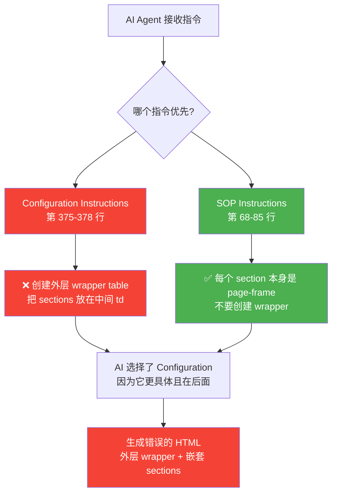

# AI Agent 错误根源追踪报告

**日期**: 2026-01-24  
**问题**: AI Agent 为什么生成错误的 `<!-- Page Frame Table: 15px margins -->`?

---

## 🔍 问题追踪

### 用户提供的错误 HTML

```html
<!-- ❌ AI 生成的错误代码 -->
<div class="printform" ...>
    <!-- Page Frame Table: 15px margins -->
    <table cellpadding="0" cellspacing="0" border="0" style="width:100%; table-layout:fixed;">
        <colgroup>
            <col style="width:15px">
            <col style="width:auto">
            <col style="width:15px">
        </colgroup>
        <tr>
            <td></td>
            <td>
                <!-- ❌ 错误:sections 嵌套在外层 wrapper table 内 -->
                <table class="pheader" ...>
                    <colgroup>
                        <col style="width:50%">  <!-- ❌ 缺少 15px/auto/15px -->
                        <col style="width:50%">
                    </colgroup>
                    ...
                </table>
            </td>
            <td></td>
        </tr>
    </table>
</div>
```

---

## 🎯 根源发现

### 冲突的指令 #1: Configuration Instructions (第 375-378 行)

**位置**: `services/gemini/systemInstructions.ts` 第 375-378 行

```typescript
// ❌ 错误的指令 (已删除)
- Enforce left/right safe margins via OUTER 3-col "page frame" tables:
  - <table cellpadding="0" cellspacing="0" border="0" style="width:${pageWidth}; table-layout:fixed;">
  - <colgroup><col style="width:15px"><col style="width:auto"><col style="width:15px"></colgroup>
  - Put all content tables inside the middle <td>.
```

**问题**: 这个指令明确要求 AI:
1. 创建一个**外层** page frame table
2. 把所有内容 tables 放在中间的 `<td>` 里

### 冲突的指令 #2: SOP Instructions (第 68-85 行)

**位置**: `services/gemini/systemInstructions.ts` 第 68-85 行

```typescript
// ✅ 正确的指令
### SOP: SECTION-AS-PAGE-FRAME TABLE (MANDATORY)
- The SECTION element itself MUST be a <table> with the section class on it
- The SECTION table MUST include a <colgroup> with EXACTLY 3 columns: 15px / auto / 15px
- Do NOT wrap sections in additional "page frame" tables.
```

**正确要求**: 每个 section **本身**就是 page-frame table,不需要外层 wrapper。

---

## 💥 冲突分析



### AI 的决策逻辑

1. **Configuration 指令更具体**: 它提供了完整的代码示例
2. **Configuration 在后面**: AI 倾向于遵循后面的指令
3. **没有明确说"不要"**: 虽然 SOP 说"Do NOT wrap",但 Configuration 说"Enforce via OUTER tables",AI 认为这是特殊配置

---

## ✅ 修复方案

### 修复 #1: 删除冲突的 Configuration 指令

**修改前**:
```typescript
- Enforce left/right safe margins via OUTER 3-col "page frame" tables:
  - <table cellpadding="0" cellspacing="0" border="0" style="width:${pageWidth}; table-layout:fixed;">
  - <colgroup><col style="width:15px"><col style="width:auto"><col style="width:15px"></colgroup>
  - Put all content tables inside the middle <td>.
```

**修改后**:
```typescript
- IMPORTANT: Do NOT create an outer wrapper "page frame" table. 
  Each section (.pheader, .pdocinfo, .prowheader, .prowitem, .pfooter_pagenum) 
  MUST be its own 3-col page-frame table (15px/auto/15px) as specified in the SOP above.
```

### 修复 #2: 增强 SOP 指令 (已完成)

添加了详细的正确/错误示例对比,消除歧义。

### 修复 #3: 升级 Print-Safe Validator (已完成)

将 section 结构验证从 warn 升级为 error,强制执行规范。

---

## 📊 修复效果预测

### 修复前

```html
<!-- AI 生成 -->
<div class="printform">
    <table>  <!-- ❌ 外层 wrapper -->
        <colgroup><col style="width:15px"><col style="width:auto"><col style="width:15px"></colgroup>
        <tr>
            <td></td>
            <td>
                <table class="pheader">  <!-- ❌ 缺少 15px/auto/15px -->
                    <colgroup><col style="width:50%"><col style="width:50%"></colgroup>
                    ...
                </table>
            </td>
            <td></td>
        </tr>
    </table>
</div>
```

### 修复后

```html
<!-- AI 应该生成 -->
<div class="printform">
    <!-- ✅ pheader 本身就是 page-frame table -->
    <table class="pheader" cellpadding="0" cellspacing="0" border="0" style="width:100%; table-layout:fixed;">
        <colgroup>
            <col style="width:15px">   <!-- ✅ 左边距 -->
            <col style="width:auto">    <!-- ✅ 内容区 -->
            <col style="width:15px">    <!-- ✅ 右边距 -->
        </colgroup>
        <tr>
            <td></td>
            <td>
                <!-- 实际内容 table -->
                <table cellpadding="0" cellspacing="0" border="0" style="width:100%; table-layout:fixed;">
                    <colgroup>
                        <col style="width:50%">
                        <col style="width:50%">
                    </colgroup>
                    <tr>
                        <td>Company Info</td>
                        <td>Document Info</td>
                    </tr>
                </table>
            </td>
            <td></td>
        </tr>
    </table>
    
    <!-- ✅ pdocinfo 本身就是 page-frame table -->
    <table class="pdocinfo" ...>
        <colgroup>
            <col style="width:15px">
            <col style="width:auto">
            <col style="width:15px">
        </colgroup>
        ...
    </table>
</div>
```

---

## 🎓 经验教训

### 1. **指令一致性至关重要**

- ❌ 不同部分的指令互相冲突
- ✅ 所有指令必须指向同一个正确模式

### 2. **后面的指令会覆盖前面的**

- AI 倾向于遵循后面出现的、更具体的指令
- Configuration 指令在最后,所以被优先采用

### 3. **需要明确的"不要"指令**

- 仅仅说"section 应该是 page-frame"不够
- 必须明确说"**不要**创建外层 wrapper table"

### 4. **代码示例比文字更有说服力**

- Configuration 提供了完整代码示例
- AI 更倾向于复制代码示例

---

## 📋 修复清单

- [x] **删除冲突的 Configuration 指令** (第 375-378 行)
- [x] **增强 SOP 指令** - 添加正确/错误示例对比
- [x] **升级 Print-Safe Validator** - 将 section 验证升级为 error
- [ ] **测试验证** - 用 AI 生成新的 HTML,确认修复效果
- [ ] **更新文档** - 记录这次修复

---

## 🎯 总结

**根本原因**: `systemInstructions.ts` 第 375-378 行的 Configuration 指令要求创建外层 wrapper table,与 SOP 规范冲突。

**解决方法**: 删除冲突指令,明确禁止创建外层 wrapper,只保留正确的 section-as-page-frame 规范。

**预期效果**: AI Agent 将正确生成每个 section 作为独立的 page-frame table,不再创建错误的外层 wrapper。

---

**修复完成时间**: 2026-01-24 02:43  
**修复人**: Tech Lead  
**影响范围**: 所有 AI 生成的 PrintForm HTML 结构
