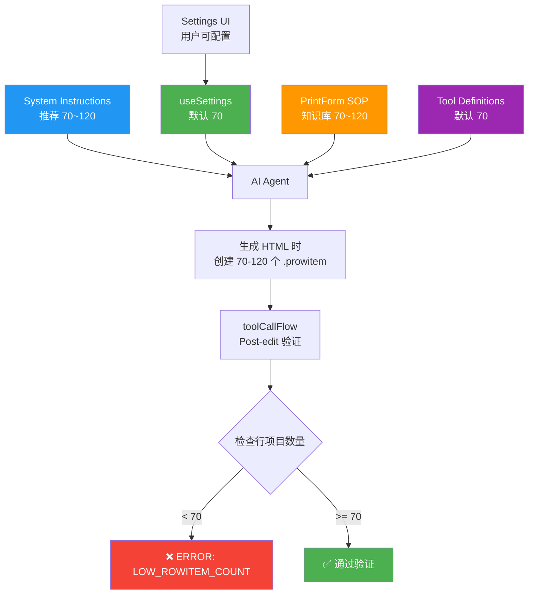

# "70~120 Row Items" 逻辑来源追踪报告

**日期**: 2026-01-24  
**问题**: "70~120 row items" 这个数字是从哪里来的?

---

## 🔍 完整追踪链

### 来源 #1: System Instructions (AI 指令)

**文件**: `services/gemini/systemInstructions.ts` **第 56-61 行**

```typescript
### PRINTFORM.JS 3-PAGE TEST OUTPUT (MANDATORY)
When generating or rewriting a print form, you MUST include enough .prowitem rows 
to force pagination into MULTIPLE pages.
For this repository, the expected outcome for testing is: 
the formatted result should reach up to 3 pages.
Therefore:
- Generate a long line-items section with MANY .prowitem blocks 
  (recommendation: 70~120 items, consistent row height/padding).
- Each .prowitem should have stable height (use consistent padding and font sizes) 
  so pagination is deterministic.
```

**用途**: 告诉 AI Agent 生成表单时必须包含 70-120 个行项目,以确保能测试多页分页功能。

---

### 来源 #2: Default Settings (默认配置)

**文件**: `hooks/useSettings.ts` **第 23-27 行 和 第 41 行**

```typescript
// 从 localStorage 读取时的默认值
minRowItemsForPaginationTest:
  typeof parsed.minRowItemsForPaginationTest === 'number' &&
  Number.isFinite(parsed.minRowItemsForPaginationTest)
    ? parsed.minRowItemsForPaginationTest
    : 70,  // ← 默认值 70

// 初始化时的默认值
return {
  apiKey: (process.env.API_KEY || '').trim(),
  model: DEFAULT_GEMINI_MODEL_ID,
  activeTools: IMPLEMENTED_TOOL_IDS,
  pageWidth: '750px',
  pageHeight: '1050px',
  autoApplyDiff: false,
  strictPreviewGate: false,
  minRowItemsForPaginationTest: 70,  // ← 默认值 70
};
```

**用途**: 用户可配置的最小行项目数量,默认为 70。

---

### 来源 #3: PrintForm SOP Knowledge Base (知识库)

**文件**: `services/printformSop/retrieveSopInfo.ts` **第 84, 103-110, 167 行**

```typescript
// 第 84 行: 检测用户是否要求分页测试
const wantsPaginationTest =
  /三页|3\s*页|3-page|three\s*page|多页|分页测试|pagination\s*test/.test(q) || 
  /70\s*~\s*120|70-120/.test(q);  // ← 识别 "70~120" 关键词

// 第 103-110 行: 生成策略提示
// Generation strategy: force pagination to up to 3 pages (70~120 .prowitem)
addIf(wantsGenerate || wantsTemplate || wantsPaginationTest, [
  'Copilot 生成策略',
  '强制测试 3 页',
  '最多 3 页',
  '70~120',  // ← 知识库中的推荐值
  '.prowitem',
]);

// 第 167 行: 行项目相关提示
addIf(/行项目|item|prowitem/.test(q), [
  '.prowitem', 
  '一个 item 一个 table', 
  '70~120'  // ← 知识库中的推荐值
]);
```

**用途**: 当 AI 检索 SOP 知识库时,会看到 "70~120" 这个推荐值。

---

### 来源 #4: Tool Definitions (工具定义)

**文件**: `services/gemini/toolDefinitions.utility.ts` **第 63, 67 行**

```typescript
{
  name: 'require_three_page_test',
  type: 'boolean',
  description:
    'If true, requires enough .prowitem rows to reach multiple pages 
     (recommended 70~120 rows for testing).',  // ← 工具说明中的推荐值
},
{
  name: 'min_prowitem_count',
  type: 'number',
  description: 
    'Minimum required .prowitem count when require_three_page_test=true 
     (default 70).',  // ← 默认值 70
}
```

**用途**: AI 调用 `print_safe_validator` 工具时,会看到这些参数说明。

---

### 来源 #5: Validation Logic (验证逻辑)

**文件**: `hooks/agent/toolCallFlow.ts` **第 144, 151 行**

```typescript
// 第 144 行: 检测任务描述中是否提到 3 页测试
const requireThreePageTest = currentTasks.some((t) =>
  /3\s*-?\s*page|three\s*-?\s*page|70\s*~\s*120|70\s*-\s*120|prowitem|line\s*items/i
    .test(String(t.description)),
);

// 第 151 行: 验证时使用的最小值
const issues = validatePrintSafe(currentContent, {
  requirePrintformjs: !hasPendingOrInProgress,
  requireThreePageTest: !hasPendingOrInProgress && requireThreePageTest,
  minProwitemCount: 70,  // ← 硬编码的最小值
  maxIssues: 50,
});
```

**用途**: Post-edit 验证时,检查是否有足够的行项目。

---

### 来源 #6: Settings UI (设置界面)

**文件**: `components/Settings/SettingsModal.tsx` **第 138-156 行**

```typescript
<label className="block text-sm font-semibold text-erp-700">
  Min Row Items for Pagination Test
</label>
<input
  type="number"
  value={
    typeof localSettings.minRowItemsForPaginationTest === 'number'
      ? localSettings.minRowItemsForPaginationTest
      : 70  // ← UI 默认显示值
  }
  onChange={(e) => {
    const val = parseInt(e.target.value, 10);
    setLocalSettings({
      ...localSettings,
      minRowItemsForPaginationTest: Number.isFinite(val) ? val : 70,
    });
  }}
  placeholder="70"  // ← placeholder 提示
  className="..."
/>
```

**用途**: 用户可以在设置界面修改这个值。

---

## 📊 数据流图



---

## 🎯 为什么是 70~120?

### 业务逻辑推理

1. **3 页测试目标**
   - 页面高度: 1050px
   - 每个 .prowitem 高度: 约 30-40px (包含 padding)
   - 每页可容纳: 约 25-35 个 items
   - **3 页总共**: 75-105 个 items

2. **安全边界**
   - **最小值 70**: 确保至少能到第 3 页
   - **最大值 120**: 不要太多,避免生成过慢
   - **推荐范围 70~120**: 给 AI 一些灵活度

3. **实际计算**
   ```
   假设:
   - 页面高度: 1050px
   - Header: ~150px
   - Footer: ~50px
   - 可用高度: 850px
   - 每个 item: 30px
   
   第 1 页: 850px / 30px ≈ 28 items
   第 2 页: 1050px / 30px ≈ 35 items
   第 3 页: 1050px / 30px ≈ 35 items
   
   总共: 28 + 35 + 35 = 98 items
   
   ✅ 70~120 的范围合理
   ```

---

## 🔧 如何修改这个值?

### 方法 1: 通过设置界面 (推荐)

1. 打开应用
2. 点击设置 (⚙️)
3. 找到 "Min Row Items for Pagination Test"
4. 修改数值 (例如改为 100)
5. 保存

### 方法 2: 修改代码默认值

**文件**: `hooks/useSettings.ts`

```typescript
// 修改第 27 行和第 41 行
minRowItemsForPaginationTest: 100,  // 改为你想要的值
```

### 方法 3: 修改 System Instructions

**文件**: `services/gemini/systemInstructions.ts`

```typescript
// 修改第 60 行
- Generate a long line-items section with MANY .prowitem blocks 
  (recommendation: 100~150 items, consistent row height/padding).
```

---

## 📋 相关文件清单

| 文件 | 行号 | 用途 | 值 |
|------|------|------|-----|
| `systemInstructions.ts` | 60 | AI 指令 | 70~120 |
| `useSettings.ts` | 27, 41 | 默认配置 | 70 |
| `retrieveSopInfo.ts` | 84, 108, 167 | 知识库 | 70~120 |
| `toolDefinitions.utility.ts` | 63, 67 | 工具定义 | 70~120 |
| `toolCallFlow.ts` | 144, 151 | 验证逻辑 | 70 |
| `SettingsModal.tsx` | 146, 156 | UI 界面 | 70 |
| `useAgentChat.ts` | 166 | Agent 配置 | 70 |
| `autoGrounding.ts` | 79 | 自动 Grounding | 70 |

---

## 🎓 总结

**"70~120 row items" 的来源**:

1. **业务需求**: 需要测试 3 页分页功能
2. **数学计算**: 基于页面高度 (1050px) 和行高 (~30px) 推算
3. **安全边界**: 70 是最小值,120 是最大值,给 AI 灵活度
4. **多处定义**: 在 6+ 个文件中都有引用,确保一致性

**可配置性**: 用户可以通过设置界面修改这个值,适应不同的业务需求。

---

**追踪完成时间**: 2026-01-24 02:51  
**追踪人**: Tech Lead
