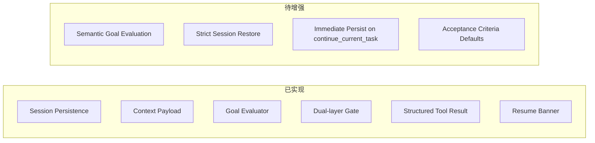

# Agentic Runtime 重构计划

> 更新日期：2026-04-07  
> 状态：Phase 1-6 已落地基础版，进入收口与增强阶段

---

## 1. 目标

将原本的 while-loop + tool_call 自动工作流，升级为带有持久化 session、显式任务状态、双层 evaluator、structured tool result、以及 resume / rollback 能力的单 agent runtime。

---

## 2. 当前实现进度

| 能力 | 状态 | 当前实现 |
|---|---|---|
| Feedback Controller | ✅ 完成 | `feedbackController.ts` |
| Dual-layer Quality Gate | ✅ 完成 | `qualityGate.ts` + `goalEvaluator.ts` |
| Session 持久化 | ✅ 完成 | `sessionManager.ts` + IndexedDB |
| Context Engineer 真正接入 | ✅ 完成 | `buildContextPayload()` 已接入 `agentLoop.ts` |
| 结构化 Tool Result | ✅ 完成 | `toolExecutor.ts` + `toolCallFlow.ts` |
| Resume UI | ✅ 完成 | `useAgentChat.ts` + `Sidebar.tsx` |
| Checkpoint-first Rollback | ✅ 完成 | `agentLoop.ts` |
| Goal 语义评估增强 | ⏳ 待增强 | 目前仍是关键词启发式 |
| 空 criteria 防早推进行为 | ⏳ 待增强 | `create_plan` 默认 `acceptanceCriteria=[]` |
| `continue_current_task` 立即落盘 | ⏳ 待增强 | 当前分支未立即 `persistSession()` |

---

## 3. 已完成的设计落地

### Phase 1: Session Runtime

- `SessionState` 已扩展：
  - `currentInput`
  - `activeTaskId`
  - `repairAttempts`
  - `loopGuardState`
  - `lastToolCall`
  - `lastToolResult`
  - `lastCheckpointId`
- 已支持：
  - `persistSession()`
  - `loadPersistedSession()`
  - `clearPersistedSession()`
  - `hasRecoverableSession()`

### Phase 2: Plan State Machine

- 已移除“编辑成功即自动完成任务”的隐式推进。
- `AgentTask` 已扩展：
  - `acceptanceCriteria`
  - `dependsOn`
  - `blockedBy`
  - `evidence`
- `manage_plan` 已支持：
  - `create_plan`
  - `add_task`
  - `mark_in_progress`
  - `mark_completed`
  - `mark_failed`
  - `block_task`
  - `unblock_task`
  - `attach_evidence`
  - `update_acceptance`

### Phase 3: Context Engineer

- `buildContextPayload()` 已成为统一入口。
- 已按任务类型裁剪：
  - file context
  - plan summary
  - validator issues
  - preview/reference context

### Phase 4: Evaluators

- 保留 `feedbackController` 做文件级校验。
- 新增 `goalEvaluator` 做任务级校验。
- `qualityGate` 已支持：
  - `pass_and_advance`
  - `continue_current_task`
  - `fix`
  - `rollback`

### Phase 5: Tool Runtime

- `ToolResult` 已支持：
  - `artifacts`
  - `stateDelta`
  - `followupHints`
- `toolCallFlow` 已支持 structured `functionResponse` 回灌。

### Phase 6: Interrupt / Resume / Guard

- 已支持 Resume Banner。
- rollback 已优先走 checkpoint restore。
- loop guard 已有 phase 字段，但 state machine 仍需进一步实质化。

---

## 4. 当前已知缺口

### P1

- `GoalEvaluator` 目前仍是关键词启发式，不足以稳健证明任务完成。
- `continue_current_task` 分支需要立即 `persistSession()`，否则中途刷新可能丢最近 checkpoint 语义。
- `create_plan` 默认 `acceptanceCriteria=[]`，建议至少生成最小 criteria，避免文件一通过就推进任务。

### P2

- Session restore 目前以 session state 为主，尚未做更严格的“文件/历史一致性校验”。
- Context 裁剪仍以截断全文为主，尚未做到片段级检索。
- 当前仍是单 agent runtime，不涉及 sub-agent / parallel agent orchestration。

---

## 5. 下一步建议

1. 收紧 `continue_current_task` 分支的 session 落盘。
2. 强化 `GoalEvaluator`，从关键词启发式升级为更可靠的任务完成判断。
3. 在 `create_plan` 时引导模型或工具生成 acceptance criteria 默认值。
4. 为 resume / rollback / goal gate 增加针对性测试。
