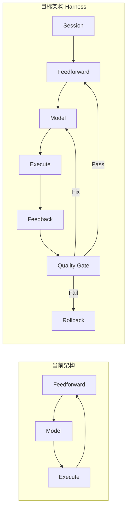

# Agentic 重构计划：Harness Engineering 架构

> 日期：2026-04-07  
> 参考：Anthropic Harness Engineering / Martin Fowler Feedforward-Feedback 模式

---

## 1. 目标

从当前的 **while-loop + tool_call 驱动** 架构，升级为完整的 **Harness Engineering** 架构，新增 Feedback Controls、Quality Gate、Session Persistence 三大能力。

---

## 2. 当前 vs 目标



| 维度 | 当前 (v2) | 目标 (v3 Harness) |
|------|-----------|-------------------|
| **循环** | while-loop + break | 同上，不变 |
| **Tool 接口** | 统一 `Tool` 接口 | 不变，已完成 |
| **Tool 注册** | `Map<string, Tool>` | 不变，已完成 |
| **校验时机** | 仅 Feedforward（执行前） | Feedforward + Feedback（执行后立即） |
| **错误处理** | catch → return | 分级：重试 / 自动修复 / 回滚 |
| **质量门禁** | 无 | 评分 0~10，Pass/Fix/Rollback |
| **会话持久化** | 无 | Checkpoint + SessionState |
| **上下文管理** | 固定组装 | 按任务类型动态裁剪 |

---

## 3. 重构步骤

### Phase 1: Feedback Controller（反馈控制层）

> 核心创新：工具执行后**立即**校验，不等下一轮

**新建文件：** `hooks/agent/feedbackController.ts`

```typescript
interface FeedbackResult {
  score: number;          // 0-10
  printSafeScore: number;
  htmlValidScore: number;
  diffReasonable: boolean;
  issues: string[];
}

async function evaluateAfterExecution(params: {
  beforeContent: string;
  afterContent: string;
  toolResult: ToolResult;
  pageWidth: string;
  pageHeight: string;
}): Promise<FeedbackResult> {
  const issues: string[] = [];
  let score = 10;

  // Sensor 1: PrintSafe 校验
  const printSafeIssues = validatePrintSafe(afterContent, { ... });
  const errors = printSafeIssues.filter(i => i.level === 'error');
  if (errors.length > 0) score -= errors.length * 2;

  // Sensor 2: HTML 结构校验
  const htmlIssues = validateStrictHtmlTables(afterContent, { ... });
  const htmlErrors = htmlIssues.filter(i => i.level === 'error');
  if (htmlErrors.length > 0) score -= htmlErrors.length * 1.5;

  // Sensor 3: Diff 合理性
  const diffSize = Math.abs(afterContent.length - beforeContent.length);
  if (diffSize > beforeContent.length * 0.8) {
    issues.push('Diff too large: >80% of file changed');
    score -= 3;
  }

  return {
    score: Math.max(0, Math.min(10, score)),
    printSafeScore: 10 - errors.length * 2,
    htmlValidScore: 10 - htmlErrors.length * 1.5,
    diffReasonable: diffSize <= beforeContent.length * 0.8,
    issues,
  };
}
```

### Phase 2: Quality Gate（质量门禁）

**新建文件：** `hooks/agent/qualityGate.ts`

```typescript
type GateDecision = 
  | { action: 'pass' }
  | { action: 'fix'; repairPrompt: string; attempt: number }
  | { action: 'rollback'; reason: string };

function decide(
  score: FeedbackResult,
  repairAttempts: number,
): GateDecision {
  if (score.score >= 8) {
    return { action: 'pass' };
  }
  if (score.score >= 4 && repairAttempts < 2) {
    return {
      action: 'fix',
      repairPrompt: buildRepairPrompt(score.issues),
      attempt: repairAttempts + 1,
    };
  }
  return {
    action: 'rollback',
    reason: score.issues.join('; '),
  };
}
```

**集成到 agentLoop.ts：**

```typescript
// 工具执行后，立即跑 Feedback + Quality Gate
const feedbackResult = await evaluateAfterExecution({
  beforeContent: snapshot,
  afterContent: currentContent,
  toolResult: result,
  pageWidth, pageHeight,
});

const decision = decide(feedbackResult, repairAttempts);

switch (decision.action) {
  case 'pass':
    session.checkpoint();
    repairAttempts = 0;
    break;
  case 'fix':
    nextInput = decision.repairPrompt;
    repairAttempts = decision.attempt;
    continue; // 回到 Model 调用
  case 'rollback':
    await toolExecutor.run('undo_last');
    showRollbackUI(decision.reason);
    return;
}
```

### Phase 3: Session Manager（会话管理器）

**新建文件：** `hooks/agent/sessionManager.ts`

```typescript
interface SessionState {
  sessionId: string;
  startedAt: number;
  tasks: AgentTask[];
  completedTools: string[];
  checkpoints: Checkpoint[];
  metrics: {
    totalTurns: number;
    toolCalls: number;
    errors: number;
    rollbacks: number;
  };
}

interface Checkpoint {
  id: string;
  timestamp: number;
  fileContent: string;
  tasks: AgentTask[];
  turnCount: number;
}

// 保存到 IndexedDB
async function saveCheckpoint(session: SessionState, content: string): Promise<void>;
async function restoreSession(sessionId: string): Promise<SessionState | null>;
async function listSessions(): Promise<SessionState[]>;
```

### Phase 4: Context Engineer（上下文工程层）

**新建文件：** `hooks/agent/contextEngineer.ts`

按任务类型动态裁剪上下文，避免 token 浪费：

```typescript
function buildContext(task: AgentTask, session: SessionState): string {
  const taskType = inferTaskType(task);

  switch (taskType) {
    case 'create':
      // 新建表单：注入模板 + PrintSafe 规则，排除历史对话
      return [template, printSafeRules, userRequest].join('\n');
    case 'fix':
      // 修复 bug：注入错误信息 + 相关代码片段，排除模板
      return [errorContext, relevantCode, userRequest].join('\n');
    case 'style':
      // 样式调整：注入当前 CSS + Preview 快照，排除 HTML 结构
      return [currentStyles, previewImage, userRequest].join('\n');
    default:
      return fullContext;
  }
}
```

---

## 4. 文件变更清单

### 新建

| 文件 | 层 | 说明 |
|------|----|----|
| `hooks/agent/feedbackController.ts` | Feedback | 执行后立即校验 |
| `hooks/agent/qualityGate.ts` | Quality Gate | 评分 + Pass/Fix/Rollback |
| `hooks/agent/sessionManager.ts` | Session | 会话持久化 + Checkpoint |
| `hooks/agent/contextEngineer.ts` | Feedforward | 按任务类型裁剪上下文 |

### 修改

| 文件 | 变更 |
|------|------|
| `hooks/agent/agentLoop.ts` | 集成 Feedback + Quality Gate 到工具执行后 |
| `hooks/agent/autoGrounding.ts` | 重构为 Feedforward 的子模块 |
| `hooks/useAgentChat.ts` | 接入 SessionState |

### 不变

| 文件 | 原因 |
|------|------|
| `hooks/agent/Tool.ts` | 接口已完善 |
| `hooks/agent/toolRegistry.ts` | 注册表已完善 |
| `hooks/agent/toolExecutor.ts` | 执行器已完善 |
| `hooks/agent/tools/*` | 各工具实现已完善 |
| `services/geminiService.ts` | API 层不变 |
| `components/*` | UI 层不变 |

---

## 5. 实施优先级

| 优先级 | Phase | 状态 | 实际改动 |
|--------|-------|------|----------|
| 1 | Phase 1: Feedback Controller | ✅ 完成 | `feedbackController.ts` (105 行) |
| 2 | Phase 2: Quality Gate | ✅ 完成 | `qualityGate.ts` (65 行) |
| 3 | 集成到 agentLoop | ✅ 完成 | `agentLoop.ts` 重写为 7 步架构 (300 行) |
| 4 | Phase 3: Session Manager | ✅ 完成 | `sessionManager.ts` (100 行) |
| 5 | Phase 4: Context Engineer | ✅ 完成 | `contextEngineer.ts` (100 行) |

---

## 6. Harness Engineering 参考资料

| 来源 | 核心概念 |
|------|----------|
| Anthropic — Effective Harnesses for Long-Running Agents | Agent = Model + Harness |
| Anthropic — Harness Design for Long-Running App Dev | Initializer + Coding Agent 双代理模式 |
| Martin Fowler — Harness Engineering for Coding Agent Users | Feedforward (Guides) + Feedback (Sensors) |
| OpenAI — Harness Engineering: Leveraging Codex | 八层 Harness 架构 |

---

## 7. 并发安全分类

| 工具 | isConcurrencySafe | 原因 |
|------|-------------------|------|
| `read_file` | 是 | 只读 |
| `read_all_files` | 是 | 只读 |
| `grep_search` | 是 | 只读 |
| `print_safe_validator` | 是 | 只读校验 |
| `html_validation` | 是 | 只读校验 |
| `load_reference_template` | 是 | 只读 |
| `diff_check` | 是 | 只读预览 |
| `modify_code` | 否 | 修改文件 |
| `insert_content` | 否 | 修改文件 |
| `undo_last` | 否 | 修改文件 |
| `manage_plan` | 否 | 修改状态 |
