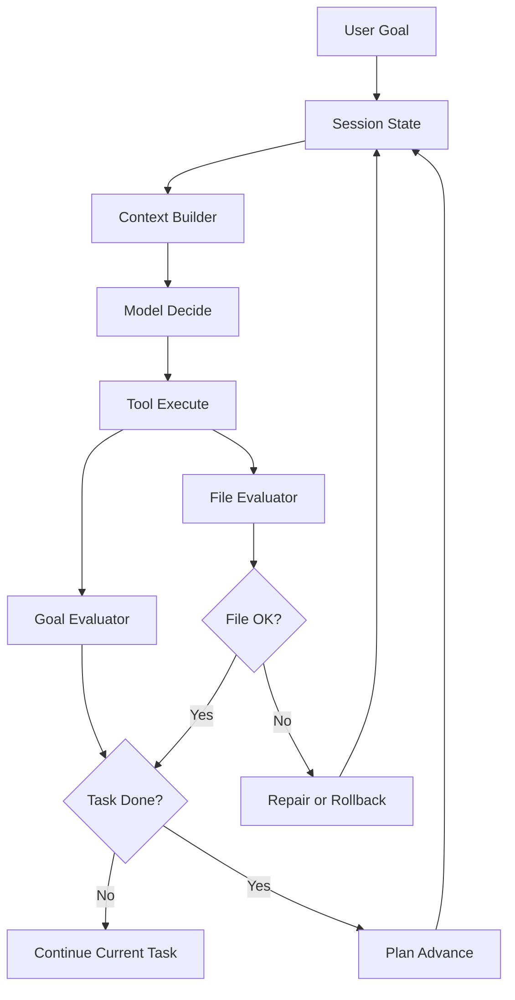
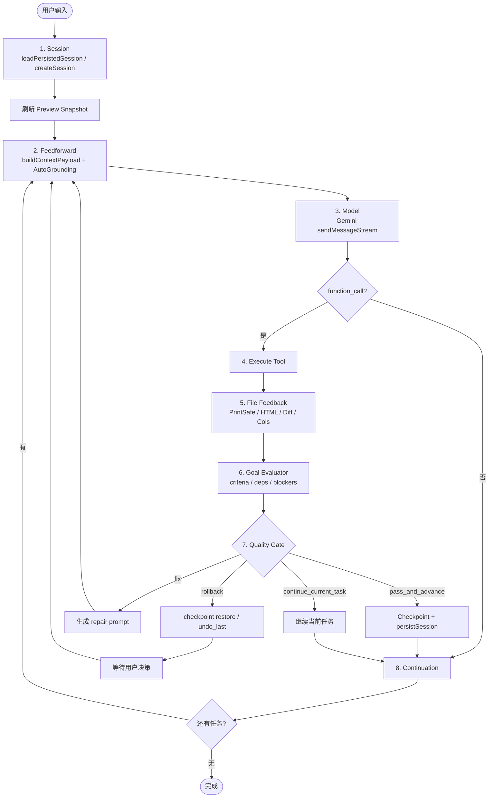

# FormGenie 架构文档

> 版本 3.1 — 2026-04-07  
> Agentic Runtime / Harness Engineering

---

## 1. 系统总览

FormGenie 是一个 AI 驱动的 ERP 打印表单生成器，使用 Google Gemini API 进行代码生成、工具调用与多轮自动修复。

当前核心公式：

**Agent = Model + Runtime State + Tool Harness + Evaluators**



---

## 2. 运行时主流程



---

## 3. 主要模块职责

| 层 | 职责 | 主要模块 |
|---|---|---|
| Session Runtime | 会话初始化、持久化、checkpoint、loop guard state | `hooks/agent/sessionManager.ts` |
| Feedforward | 按任务类型裁剪 prompt，上下文组装 | `hooks/agent/contextEngineer.ts` |
| Auto-Grounding | 注入 print-safe / 模板 / 视觉上下文 | `hooks/agent/autoGrounding.ts` |
| Model Caller | 与 Gemini 流式交互，解析 function call | `hooks/agent/agentLoop.ts` |
| Tool Runtime | 工具执行、structured result、tool audit | `hooks/agent/toolExecutor.ts`, `hooks/agent/toolCallFlow.ts` |
| File Evaluator | 文件级校验：PrintSafe / HTML / Diff / Cols | `hooks/agent/feedbackController.ts` |
| Goal Evaluator | 任务级校验：criteria / blockers / deps | `hooks/agent/goalEvaluator.ts` |
| Gate | 双层决策：`pass_and_advance` / `continue_current_task` / `fix` / `rollback` | `hooks/agent/qualityGate.ts` |
| UI Integration | Resume banner、task panel、chat orchestration | `hooks/useAgentChat.ts`, `components/Layout/Sidebar.tsx` |

---

## 4. 核心数据结构

### 4.1 SessionState

```ts
interface SessionState {
  sessionId: string;
  startedAt: number;
  tasks: AgentTask[];
  checkpoints: Checkpoint[];
  currentInput: string;
  activeTaskId?: string;
  repairAttempts: number;
  loopGuardState: LoopGuardState;
  lastToolCall?: { name: string; args: any };
  lastToolResult?: { success: boolean; output: string };
  lastCheckpointId?: string;
  persisted: boolean;
  metrics: {
    totalTurns: number;
    toolCalls: number;
    errors: number;
    rollbacks: number;
    repairAttempts: number;
  };
}
```

### 4.2 AgentTask

```ts
interface AgentTask {
  id: string;
  description: string;
  status: 'pending' | 'in_progress' | 'completed' | 'failed' | 'retrying';
  acceptanceCriteria?: string[];
  dependsOn?: string[];
  blockedBy?: string[];
  evidence?: string[];
}
```

### 4.3 GoalEvaluatorResult

```ts
interface GoalEvaluatorResult {
  goalSatisfied: boolean;
  remainingGaps: string[];
  confidence: number;
  recommendedNextAction: 'continue_current_task' | 'advance_plan' | 'rollback';
}
```

### 4.4 ToolResult

```ts
interface ToolResult {
  success: boolean;
  output: string;
  updatedContent?: string;
  artifacts?: Record<string, any>;
  stateDelta?: Record<string, any>;
  followupHints?: string[];
}
```

---

## 5. 当前已实现能力

- Session 已持久化到 IndexedDB，并支持恢复最近 session。
- Resume banner 已接入 Sidebar。
- destructive edit 后会触发文件级 feedback。
- 质量门禁已升级为双层：文件级 + 任务级。
- `manage_plan` 已支持 `block_task`、`unblock_task`、`attach_evidence`、`update_acceptance`。
- 工具结果已支持 structured `functionResponse` 回灌。
- rollback 优先恢复最近 checkpoint，失败时再回退 `undo_last`。

---

## 6. 当前已知限制

- `GoalEvaluator` 仍是关键词启发式，不是强语义验证。
- 新建 plan 默认 `acceptanceCriteria=[]`；如果模型不主动补齐，任务推进仍可能偏宽松。
- `continue_current_task` 分支虽然会保存 checkpoint，但 session 落盘时机仍可进一步收紧。
- Context 裁剪已接入，但文件上下文仍以截断原文为主，尚未做到“只取相关片段”。

---

## 7. 工程判断

当前系统已经不是简单的 “chat + function calling”，而是一个带有：

- runtime state
- tool orchestration
- file evaluator
- goal evaluator
- structured rollback
- resume UI

的单 agent runtime。

但它仍处于 **Agentic Runtime v1.5** 阶段，还未达到强语义任务评估、严格 session 恢复、或多 agent 协同级别。
