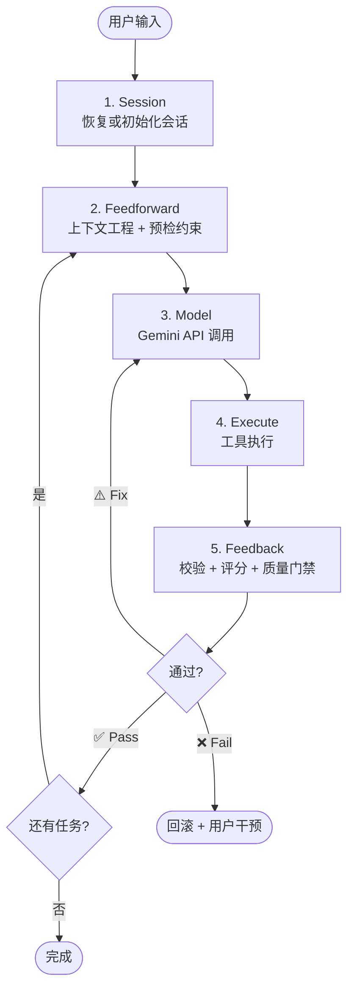
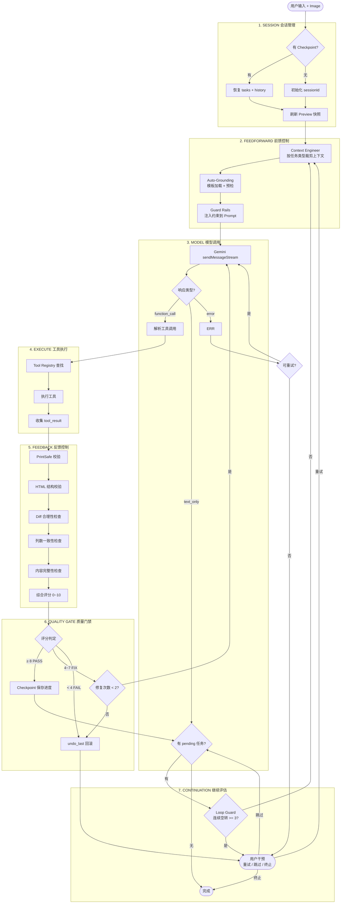

# FormGenie 架构文档

> 版本 3.0 — 2026-04-07  
> Harness Engineering 架构设计

---

## 1. 系统总览

FormGenie 是一个 AI 驱动的 ERP 打印表单生成器，使用 Google Gemini API 进行智能代码生成。

架构核心公式：**Agent = Model + Harness**

```
┌─────────────────────────────────────────┐
│              AGENT HARNESS              │
│                                         │
│  Session → Feedforward → [Model] →      │
│  Execute → Feedback → Quality Gate      │
│                                         │
│         ┌───────────┐                   │
│         │ Gemini API│ ← Model           │
│         └───────────┘                   │
└─────────────────────────────────────────┘
```

---

## 2. 高层架构（L1）

> 设计目标：5 秒内看懂主流程



**核心循环 5 步：** Session → Feedforward → Model → Execute → Feedback → 回到 Feedforward

---

## 3. 详细流程（L2）

> 设计目标：30 秒内理解所有分支，给工程师实现用



---

## 4. Harness 七层架构

### 4.1 各层职责

| 层 | 职责 | 对应模块 |
|----|------|----------|
| **Session Manager** | 会话初始化/恢复、Checkpoint、metrics 统计 | `sessionManager.ts` ✅ |
| **Feedforward Controls** | 上下文裁剪、Auto-Grounding、Guard Rails 注入 | `contextEngineer.ts` + `autoGrounding.ts` ✅ |
| **Model Caller** | Gemini API 流式调用、响应解析 | `agentLoop.ts` → `callModelAndStream()` ✅ |
| **Tool Executor** | 工具注册、查找、执行 | `toolRegistry.ts` + `toolExecutor.ts` ✅ |
| **Feedback Controls** | 执行后立即校验（PrintSafe / HTML / Diff / Visual） | `feedbackController.ts` ✅ |
| **Quality Gate** | 综合评分、Pass/Fix/Rollback 决策 | `qualityGate.ts` ✅ |
| **Continuation Evaluator** | pending 任务检查、Loop Guard、任务调度 | `agentLoop.ts` → `evaluateContinuation()` ✅ |

### 4.2 Feedforward vs Feedback

```
┌──────────────────────────────────────────┐
│         FEEDFORWARD (执行前)              │
│                                          │
│  Template Loader → PrintSafe Pre-check   │
│  → Context Pruner → Guard Rails          │
│                                          │
│  目的：防止模型犯错                        │
└──────────────────────────────────────────┘
                    │
               [模型执行]
                    │
┌──────────────────────────────────────────┐
│          FEEDBACK (执行后)                │
│                                          │
│  PrintSafe Validator → HTML Linter       │
│  → Diff Size → Column Alignment → Integrity│
│                                          │
│  目的：发现并修复模型的错误                 │
└──────────────────────────────────────────┘
```

**关键区别：** Feedback 在每次工具执行后**立即**运行，不等到下一轮。

---

## 5. 核心数据结构

### 5.1 SessionState（已实现 — `sessionManager.ts`）

```typescript
interface SessionState {
  sessionId: string;
  startedAt: number;
  tasks: AgentTask[];
  checkpoints: Checkpoint[];
  metrics: {
    totalTurns: number;
    toolCalls: number;
    errors: number;
    rollbacks: number;
    repairAttempts: number;
  };
}
```

### 5.2 FeedbackResult（已实现 — `feedbackController.ts`）

```typescript
interface FeedbackResult {
  score: number;           // 0-10 综合评分
  printSafeScore: number;  // 0-10
  htmlValidScore: number;  // 0-10
  diffReasonable: boolean;
  issues: string[];        // 具体问题列表
}
```

### 5.3 Tool 接口（已实现）

```typescript
interface Tool {
  name: string;
  friendlyName: string;
  statusText: string;
  isConcurrencySafe: boolean;
  isDestructive: boolean;
  call(args: any, context: ToolContext): Promise<ToolResult>;
}
```

---

## 6. Tool 系统

### 6.1 工具注册表

工具在 `hooks/agent/toolRegistry.ts` 中集中管理：

| 工具 | 类型 | 并发安全 | 破坏性 |
|------|------|----------|--------|
| `manage_plan` | 状态管理 | 否 | 是 |
| `modify_code` | 代码编辑 | 否 | 是 |
| `insert_content` | 代码编辑 | 否 | 是 |
| `undo_last` | 代码编辑 | 否 | 是 |
| `read_file` | 只读 | 是 | 否 |
| `read_all_files` | 只读 | 是 | 否 |
| `grep_search` | 只读 | 是 | 否 |
| `diff_check` | 校验 | 是 | 否 |
| `print_safe_validator` | 校验 | 是 | 否 |
| `html_validation` | 校验 | 是 | 否 |
| `load_reference_template` | 只读 | 是 | 否 |

### 6.2 工具执行流程

```
Tool Registry → resolveToolName → getToolByName → tool.call(args, context) → ToolResult
```

---

## 7. 循环伪代码

```typescript
while (turn < MAX_TURNS) {
  // FEEDFORWARD
  const context = contextEngineer.build(task, session);
  const prompt  = feedforward.apply(context);

  // MODEL CALL
  const response = await gemini.stream(prompt);
  const { toolCall, text } = parse(response);

  if (!toolCall) {
    const next = continuationEvaluator.decide(text, session);
    if (next.stop) break;
    continue;
  }

  // TOOL EXECUTION
  const result = await toolExecutor.run(toolCall);

  // FEEDBACK (立即验证)
  const score = await feedbackController.evaluate({
    before: snapshot,
    after:  currentContent,
    result,
  });

  // QUALITY GATE
  if (score >= 8) {
    session.checkpoint();
  } else if (score >= 4) {
    await autoRepair(score.issues);
  } else {
    toolExecutor.run('undo_last');
    notify(user, score.issues);
    break;
  }
}
```

---

## 8. 上下文组装

Gemini API 每次请求组装以下上下文：

```
System Instruction (一次性设定)
├── BASE_SYSTEM_INSTRUCTION (角色/规则/SOP)
├── getConfigurationInstruction (页面尺寸)
├── VISION_INSTRUCTION (如启用图片分析)
├── EXPLAIN_CODE_INSTRUCTION (如启用解释模式)
└── TOOL_FALLBACK_INSTRUCTION (如回退到 json_directive)

每轮消息内容
├── [AUTO_GROUNDING] — 预检结果 + 模板 + 约束
├── [CURRENT FILE CONTEXT] — 当前文件内容 (截断)
├── [CURRENT PLAN STATUS] — 任务计划状态
├── [IMAGE:REFERENCE] + [IMAGE:CURRENT_PREVIEW] (如有)
└── User Request
```

---

## 9. 数据持久化

| 数据 | 存储 | 模块 |
|------|------|------|
| 项目文件 | IndexedDB | `utils/indexedDb.ts` |
| 文件历史 | IndexedDB | `utils/indexedDb.ts` |
| 用户设置 | localStorage | `hooks/useSettings.ts` |
| 审计日志 | 内存 (singleton) | `utils/auditLogger.ts` |
| 会话进度 | 内存 (Checkpoint) | `sessionManager.ts` |

---

## 10. 消息系统

```typescript
interface Message {
  id: string;
  sender: 'user' | 'bot';
  text: string;
  timestamp: number;
  isStreaming?: boolean;
  statusText?: string;
  attachment?: { mimeType: string; data: string };
  toolCall?: { name: string; args: any; status: 'pending' | 'success' | 'error' };
  action?: { type: 'continue_execution'; label: string; onAction: () => void };
  actions?: Array<{ label: string; variant?: string; onAction: () => void }>;
  collapsible?: { title: string; content: string; defaultOpen?: boolean };
}
```

---

## 11. 目录结构

```
├── components/
│   ├── Chat/           # 聊天界面
│   ├── Editor/         # Monaco Editor
│   ├── Layout/         # 布局
│   ├── Preview/        # 打印预览
│   ├── Settings/       # 设置
│   └── Sidebar/        # 侧边栏面板
├── hooks/
│   ├── agent/          # Agentic 核心 (Harness)
│   │   ├── agentLoop.ts           # while-loop 主循环
│   │   ├── autoGrounding.ts       # Feedforward: 自动上下文增强
│   │   ├── contextEngineer.ts     # Feedforward: 上下文裁剪
│   │   ├── feedbackController.ts  # Feedback: 后验控制
│   │   ├── qualityGate.ts         # Quality Gate: 评分决策
│   │   ├── sessionManager.ts      # Session: 会话持久化
│   │   ├── Tool.ts                # Tool 接口定义
│   │   ├── toolRegistry.ts        # Tool 注册表
│   │   ├── toolExecutor.ts        # Tool 执行器
│   │   ├── toolCallFlow.ts        # Tool 调用流程控制
│   │   ├── textToolCall.ts        # 文本工具调用解析
│   │   ├── diffConfirmation.ts    # Diff 确认流程
│   │   ├── conversationTypes.ts   # 对话类型定义
│   │   └── tools/                 # 各工具实现
│   │       ├── EditingTools.ts
│   │       ├── ReadTools.ts
│   │       ├── ManagePlanTool.ts
│   │       └── UtilityTools.ts
│   ├── useAgentChat.ts    # Agent 聊天 Hook
│   ├── useFormBuilder.ts  # Facade Hook
│   ├── useFileProject.ts  # 文件/项目管理
│   ├── useSettings.ts     # 设置管理
│   ├── useLayoutState.ts  # 布局状态
│   └── useResizable.ts    # 拖拽调整
├── services/
│   ├── geminiService.ts          # Gemini API 服务
│   ├── gemini/                   # Gemini 配置
│   ├── printformSop/             # PrintForm.js SOP RAG
│   ├── agentAugmenters/          # Agent 增强器
│   └── rag/                      # Semantic RAG
├── utils/                        # 工具函数
├── docs/                         # 文档
├── App.tsx                       # 主应用
├── types.ts                      # 全局类型
└── constants.ts                  # 常量
```

---

## 12. 技术栈

- **UI**: React 19 + TypeScript + Tailwind CSS
- **编辑器**: Monaco Editor
- **AI**: Google Gemini API (`@google/genai`)
- **构建**: Vite 6
- **测试**: Vitest + Testing Library
- **持久化**: IndexedDB + localStorage
