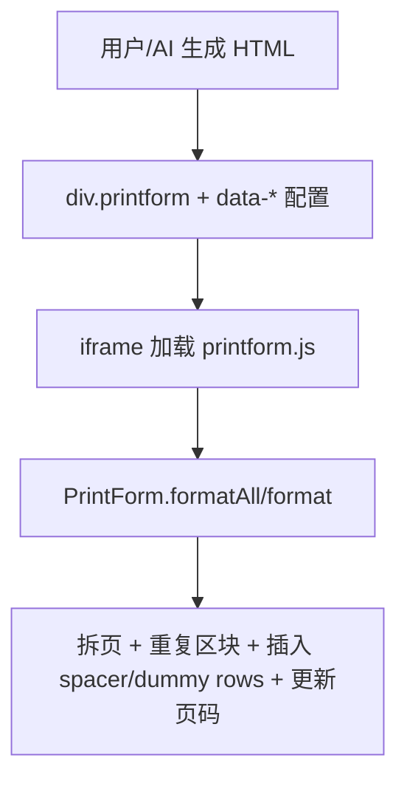
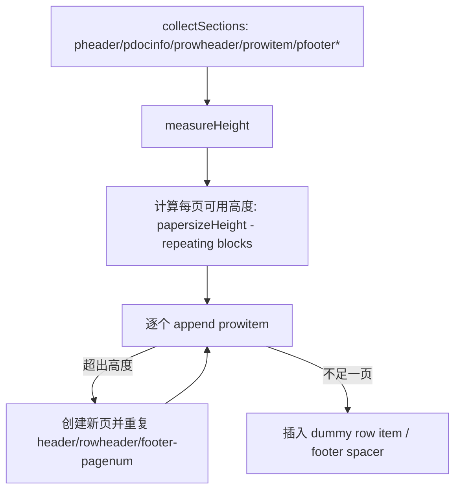

# PrintForm.js SOP（给 AI Copilot / 模板生成用）

> 目标：让 AI 生成的 HTML 能被 `printform.js` 正确分页、重复页眉/表头/页脚，并更新页码占位符。



## 1) 运行机制（你需要“配合”的点）

- `printform.js` 会扫描页面内所有 `.printform` 容器，并将其**拆分成多页 DOM**（物理页）。
- 你提供的 HTML 必须使用它认识的 **className**（区块识别）与 **data-\* 配置**（纸张尺寸/重复规则/填充策略）。
- 在本项目里，预览 iframe 会加载 `dist/printform.js` 并调用：
  - `PrintForm.formatAll({ force: true, papersizeWidth, papersizeHeight })`

## 2) 必须遵守的 DOM 结构（最小可用）

## 2.0 标准骨架模板（推荐直接复用）

> 说明：这是“最小可用 + 易分页”的骨架。你只需要把 `.prowitem` 重复很多次（建议 70~120 个）就能稳定测到分页（最多 3 页）。

```html
<div
  class="printform"
  style="width:750px; min-height:1050px; margin:0 auto; box-sizing:border-box; padding:0; background:#fff;"
  data-papersize-width="750"
  data-papersize-height="1050"
  data-repeat-header="y"
  data-repeat-rowheader="y"
  data-repeat-footer-pagenum="y"
  data-show-logical-page-number="y"
  data-insert-footer-spacer-while-format-table="y"
  data-insert-dummy-row-item-while-format-table="y"
>
  <!-- 统一页边距：外层 3 栏 Table（15px / auto / 15px） -->
  <table cellpadding="0" cellspacing="0" border="0" style="width:750px; table-layout:fixed;">
    <colgroup>
      <col style="width:15px" />
      <col style="width:auto" />
      <col style="width:15px" />
    </colgroup>
    <tr>
      <td style="box-sizing:border-box;"></td>
      <td style="box-sizing:border-box; vertical-align:top;">
        <!-- pheader（每页重复） -->
        <div class="pheader">
          <table cellpadding="0" cellspacing="0" border="0" style="width:100%; table-layout:fixed;">
            <colgroup>
              <col style="width:70%" />
              <col style="width:30%" />
            </colgroup>
            <tr>
              <td style="box-sizing:border-box; padding:8px 0; font-weight:700;">INVOICE</td>
              <td style="box-sizing:border-box; padding:8px 0; text-align:right;">INV-0001</td>
            </tr>
          </table>
        </div>

        <!-- prowheader（每页重复） -->
        <div class="prowheader">
          <table cellpadding="0" cellspacing="0" border="0" style="width:100%; table-layout:fixed;">
            <colgroup>
              <col style="width:55%" />
              <col style="width:15%" />
              <col style="width:15%" />
              <col style="width:15%" />
            </colgroup>
            <tr style="background:#f3f4f6; font-size:11px; font-weight:700;">
              <td style="box-sizing:border-box; padding:6px 4px;">Description</td>
              <td style="box-sizing:border-box; padding:6px 4px; text-align:center;">Qty</td>
              <td style="box-sizing:border-box; padding:6px 4px; text-align:right;">Unit</td>
              <td style="box-sizing:border-box; padding:6px 4px; text-align:right;">Total</td>
            </tr>
          </table>
        </div>

        <!-- prowitem：每个 item 一个元素（建议一个 item 一个 table，保持高度稳定） -->
        <div class="prowitem">
          <table cellpadding="0" cellspacing="0" border="0" style="width:100%; table-layout:fixed;">
            <colgroup>
              <col style="width:55%" />
              <col style="width:15%" />
              <col style="width:15%" />
              <col style="width:15%" />
            </colgroup>
            <tr style="font-size:11px;">
              <td style="box-sizing:border-box; padding:6px 4px;">Item 001</td>
              <td style="box-sizing:border-box; padding:6px 4px; text-align:center;">1</td>
              <td style="box-sizing:border-box; padding:6px 4px; text-align:right;">10.00</td>
              <td style="box-sizing:border-box; padding:6px 4px; text-align:right;">10.00</td>
            </tr>
          </table>
        </div>

        <!-- TODO：复制上面的 .prowitem 70~120 次，用于触发分页（最多 3 页测试） -->

        <!-- 页码（每页重复） -->
        <div class="pfooter_pagenum" style="margin-top:12px; font-size:10px; color:#6b7280;">
          Page <span data-page-number></span> of <span data-page-total></span>
        </div>
      </td>
      <td style="box-sizing:border-box;"></td>
    </tr>
  </table>
</div>
```

### 2.1 Root

- 必须有且仅有一个 root 容器：
  - `<div class="printform" ...>...</div>`

### 2.2 分页可识别的区块 class（核心）

| 区块意义                  | className                                   | 说明                                                                 |
| ------------------------- | ------------------------------------------- | -------------------------------------------------------------------- |
| 页眉                      | `.pheader`                                  | 每页可重复                                                           |
| 单据信息（可选）          | `.pdocinfo` / `.pdocinfo002`…`.pdocinfo005` | 可按开关重复                                                         |
| 行项目表头（可选但推荐）  | `.prowheader`                               | 每页可重复（一般是表头）                                             |
| 行项目（必须）            | `.prowitem`                                 | **每个行项目必须是独立元素**（建议“一个 item 一个 table”以稳定高度） |
| 页脚（业务 footer，可选） | `.pfooter` / `.pfooter002`…`.pfooter005`    | 可按开关重复（最后页会合并）                                         |
| 页脚 Logo（可选）         | `.pfooter_logo`                             | 可按开关重复                                                         |
| 页码区块（强烈建议）      | `.pfooter_pagenum`                          | 用于展示 Page X of Y                                                 |

> 重点：`printform.js` 的行项目选择器包含 `.prowitem`（也包含 PTAC / PADDT 变体）。本项目 SOP 以 `.prowitem` 为主。

## 3) data-\* 配置（最常用/最重要）

`printform.js` 会合并配置：`DEFAULT_CONFIG` + legacy + `.printform.dataset` + overrides。

### 3.1 纸张尺寸（必须）

- `data-papersize-width="750"`（数字，px；不要写 `750px`）
- `data-papersize-height="1050"`（数字，px；不要写 `1050px`）

> 本项目 settings 是 `pageWidth/pageHeight`（字符串含 px），Copilot 生成 HTML 时要同步写入 data-attr 的“纯数字”版本。

### 3.2 重复/分页常用开关（推荐默认开启）

- `data-repeat-header="y"`：重复 `.pheader`
- `data-repeat-rowheader="y"`：重复 `.prowheader`
- `data-repeat-footer-pagenum="y"`：重复 `.pfooter_pagenum`（每页都显示页码）
- `data-insert-footer-spacer-while-format-table="y"`：插入 spacer 把页脚顶到底部（更像正式表单）
- `data-insert-dummy-row-item-while-format-table="y"`：不足一页时用 dummy row item 填充高度（让 footer 位置稳定）

### 3.3 页码显示（推荐）

- `data-show-logical-page-number="y"`：显示逻辑页码（Page 1 of N）
- `data-show-physical-page-number="n"`：物理页码（Sheet 1 of N）通常不用

## 4) 页码占位符规则（强烈建议按这个写）

在 `.pfooter_pagenum` 内放：

- `<span data-page-number></span>`：当前页
- `<span data-page-total></span>`：总页数

`printform.js` 会自动填入文本。如果你不放这些 data-attr，它会尝试 fallback：在一个容器里插入 placeholder 文本。

## 5) 分页算法要点（为什么你的 HTML 要这样写）



为了让这个算法稳定：

- `.prowitem` 高度要尽量一致、可预测（固定 padding/字体/边框）
- 避免依赖内容自适应导致高度剧烈波动（例如超长段落不分行、不控制 line-height）
- 避免在 `.prowitem` 内塞入巨大的图片/复杂嵌套

## 6) Copilot 生成策略（强制测试 3 页）

为了验证 `printform.js` 在本项目里真的生效，Copilot 生成/重写表单时必须：

- 生成足够多的 `.prowitem`（建议 70~120 个，取决于 row 高度与页高）
- 让分页结果达到 **最多 3 页**（用于测试）
- 每个 `.prowitem` 用一致的结构与样式（让分页可预测）

## 7) 常见踩坑清单

- 错误：把纸张宽高写成 `data-papersize-width="750px"` → 正确：`"750"`
- 错误：不使用 `.pheader/.prowheader/.prowitem` → 结果：不分页或不重复
- 错误：把所有行项目放在一个大 table 的多行里 → 结果：高度测量/拆分可能不稳定（推荐 “一个 `.prowitem` 一个 table”）
- 错误：页码不加 `[data-page-number]/[data-page-total]` → 结果：只能用 fallback 文本，且位置不一定符合你 UI 预期
